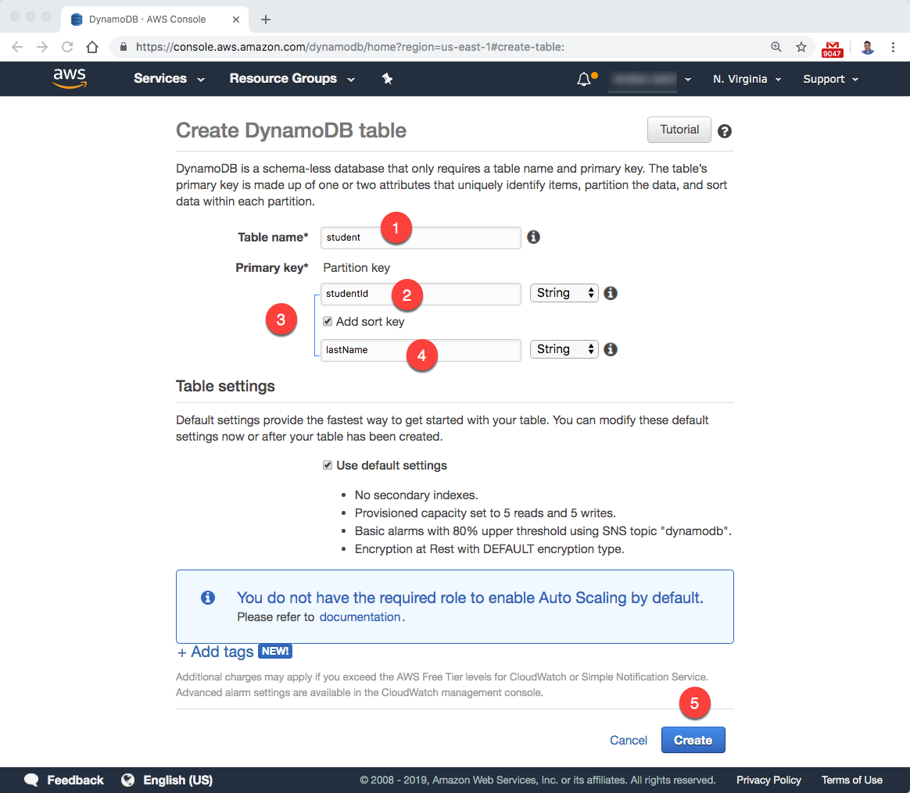
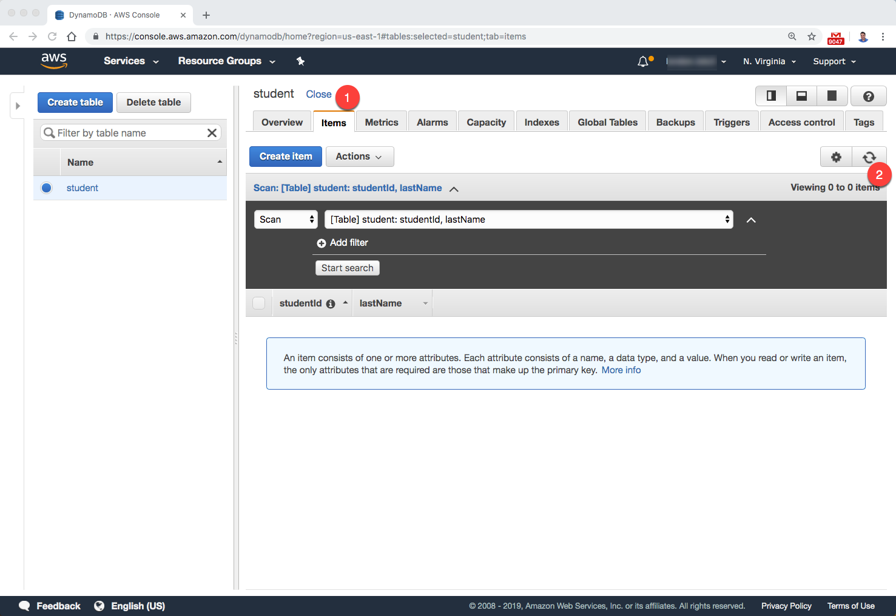
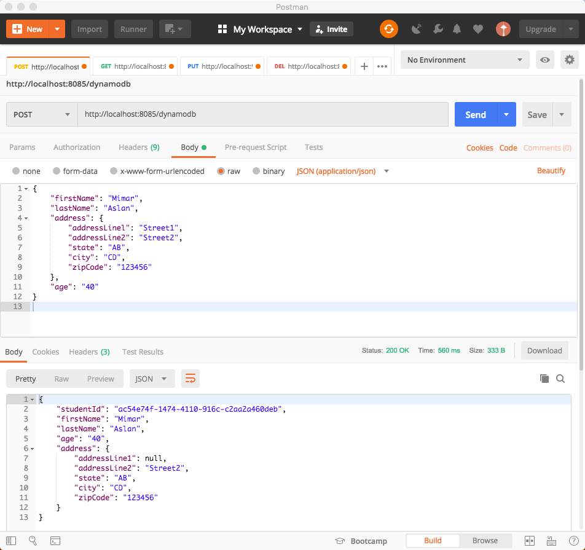
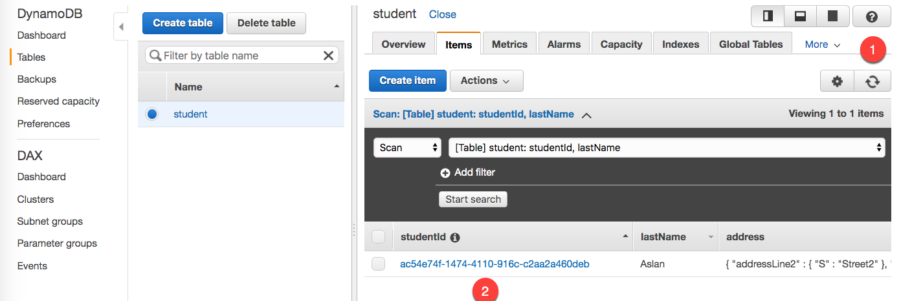
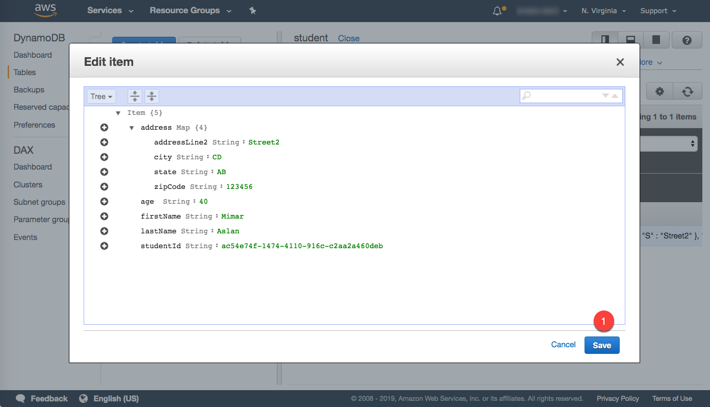
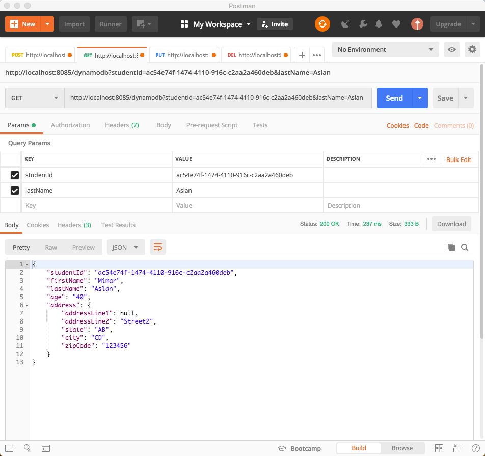
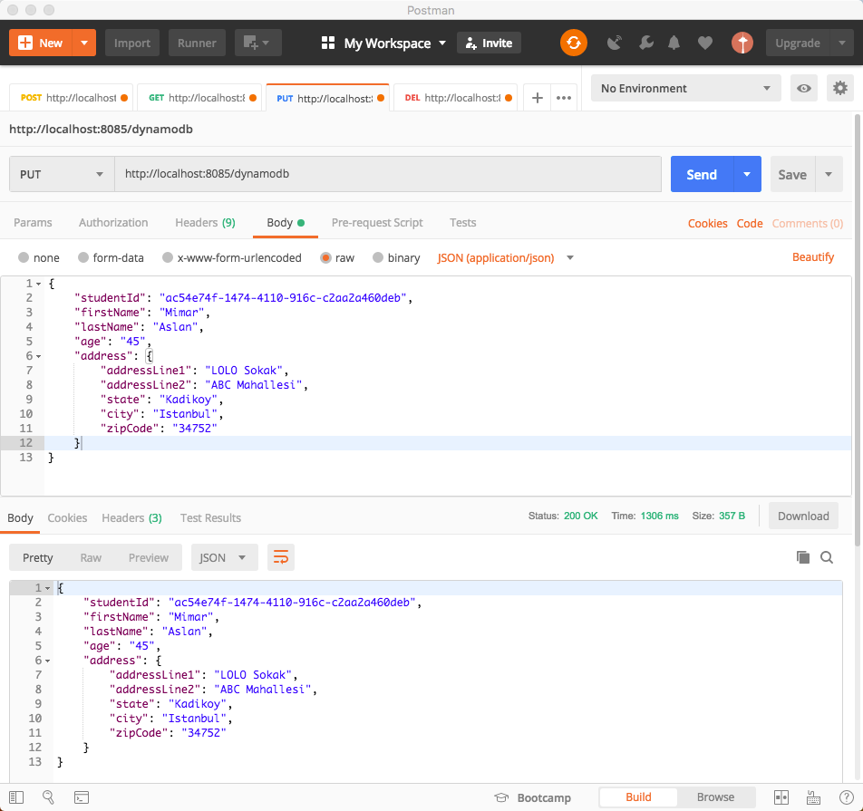
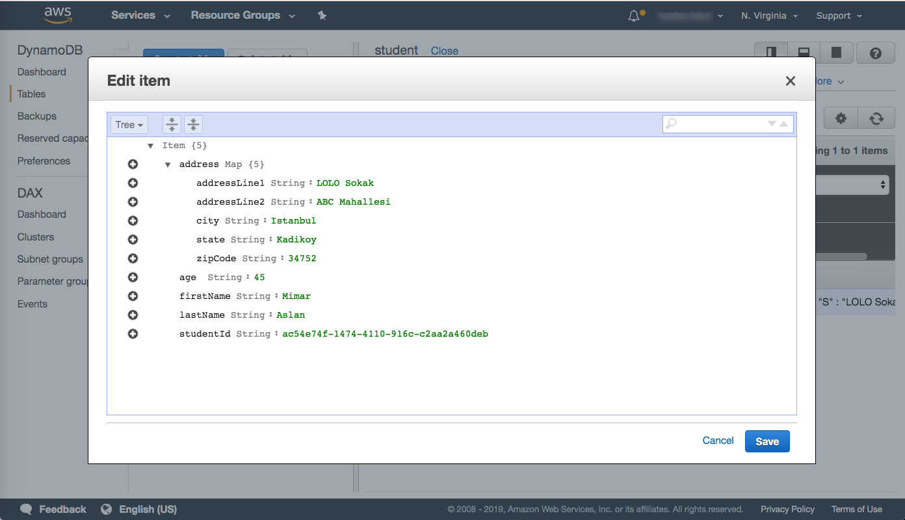
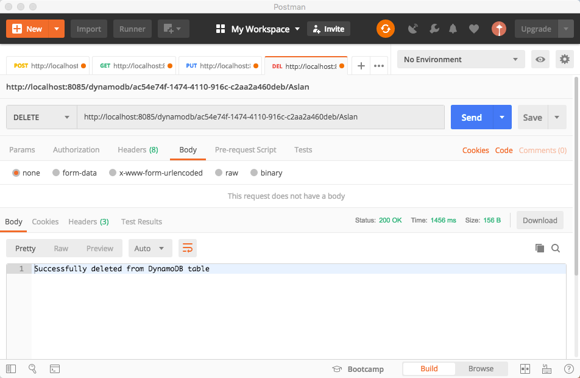
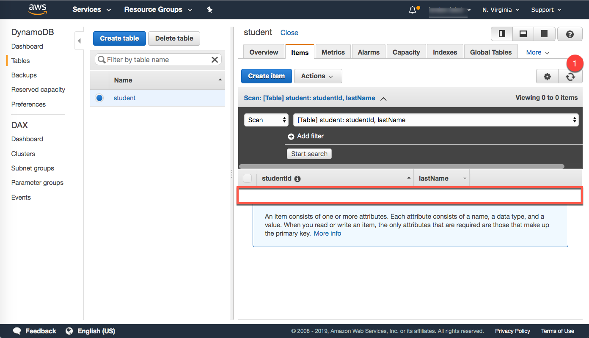

AWS DynamoDB range key demo project for Spring Boot

DynamoDB Create Table

POST

GET

PUT

DELETE

###  POST
http://localhost:8085/dynamodb

{
"firstName": "Mimar",
"lastName": "Aslan",
"address": {
"addressLinel": "Street1",
"addressLine2": "Street2",
"state": "AB",
"city": "CD",
"zipCode": "123456"
},
"age": "40"
}

###  GET
http://localhost:8085/dynamodb?studentId=ID_NUMBER&lastName=LAST_NAME

###  PUT
http://localhost:8085/dynamodb

{
"studentId": "ID_NUMBER",
"firstName": "Mimar",
"lastName": "Aslan",
"age": "45",
"address": {
"addressLine1": "LOLO Sokak",
"addressLine2": "ABC Mahallesi",
"state": "Kadikoy",
"city": "Istanbul",
"zipCode": "34752"
}
}

###  DELETE
http://localhost:8085/dynamodb/ID_NUMBER/LAST_NAME

