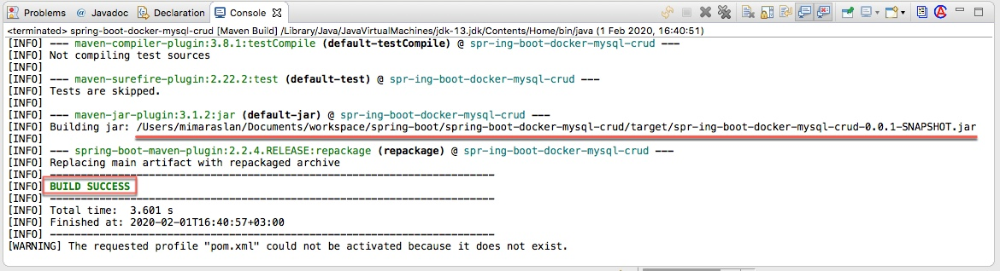
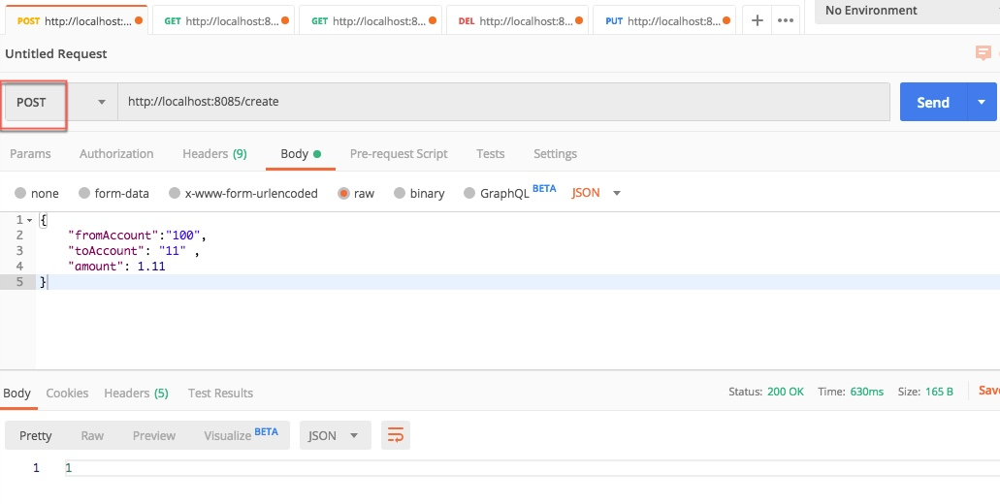
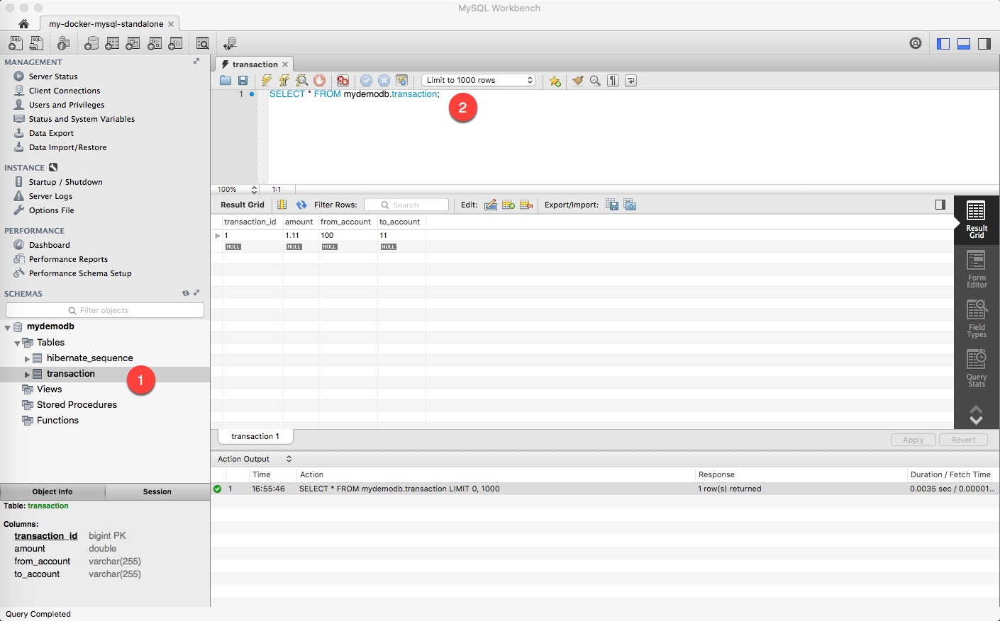
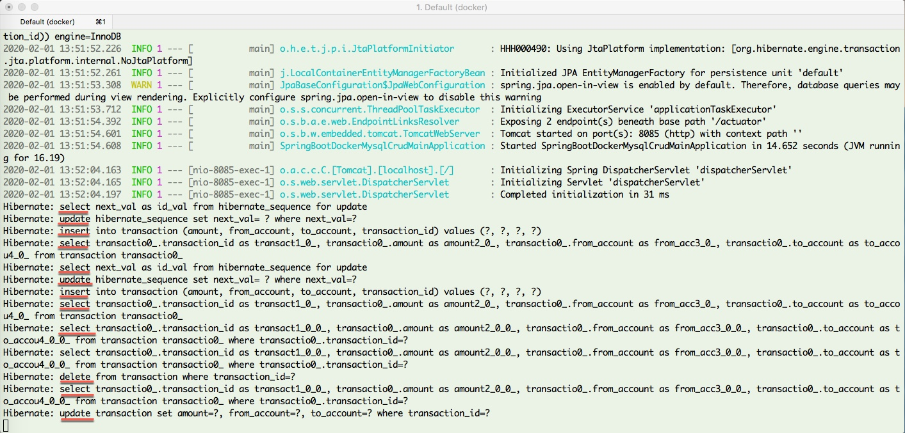
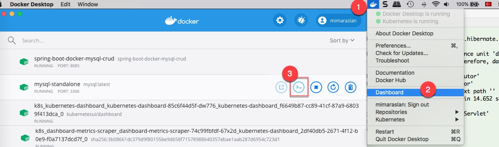

# spring-boot-dockerize

Spring Boot to Docker

Running Spring Boot Project on Docker

HTTP request method type: GET  
http://localhost:8082/api/v1//api/v1/employees

OPEN A TERMINAL  
cd /Users/mimaraslan/Documents/workspace/spring-boot/spring-boot-backend-crud/

docker build -t spring-boot-backend-crud:latest . 

docker images

docker run -p 8082:8082 -t spring-boot-backend-crud --link mysql-standalone:mysql spring-boot-backend-crud 